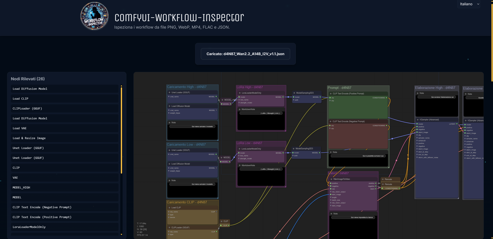

<div align="center">
  
</div>

# ComfyUI Workflow Inspector

[![Contributors][contributors-shield]][contributors-url]
[](https://github.com/d4N-87/ComfyUI-Workflow-Inspector/releases)
[![Stargazers][stars-shield]][stars-url]
[![Issues][issues-shield]][issues-url]
[![LinkedIn][linkedin-shield]][linkedin-url]

https://img.shields.io/github/v/

**Ispeziona e visualizza i metadati dei workflow ComfyUI incorporati in file PNG, WebP, MP4, FLAC e JSON con un'interfaccia intuitiva e multilingua.**

**Inspect and visualize ComfyUI workflow metadata embedded in PNG, WebP, MP4, FLAC, and JSON files with an intuitive, multilingual interface.**

---

<!-- Link to Live Demo will go here -->
**[➡️ Prova la Demo Live! / Try the Live Demo!](#)** (Link da aggiornare)

---

## ✨ Funzionalità / Features

*   🇮🇹 **Caricamento Intelligente**: Supporta workflow da file PNG, WebP, MP4, FLAC e JSON.
    🇬🇧 **Smart Upload**: Supports workflows from PNG, WebP, MP4, FLAC, and JSON files.
*   🇮🇹 **Visualizzazione Nodi**: Elenco chiaro dei nodi rilevati nel workflow.
    🇬🇧 **Node Display**: Clear list of detected nodes in the workflow.
*   🇮🇹 **Rendering Grafo Interattivo**: Grafo del workflow renderizzato con [LiteGraph.js](https://github.com/jagenjo/litegraph.js), con colori dei link e nomi dei nodi il più possibile fedeli a ComfyUI (basati su `object_info.json`).
    🇬🇧 **Interactive Graph Rendering**: Workflow graph rendered using [LiteGraph.js](https://github.com/jagenjo/litegraph.js), with link colors and node names as faithful as possible to ComfyUI (based on `object_info.json`).
*   🇮🇹 **Visualizzazione Note**: Le note del workflow (normali e Markdown) sono mostrate in una sezione dedicata.
    🇬🇧 **Notes Display**: Workflow notes (both regular and Markdown) are shown in a dedicated section.
*   🇮🇹 **Interfaccia Multilingua**: Disponibile in Italiano, Inglese, Francese, Tedesco e Spagnolo (IT, EN, FR, DE, ES) con selettore.
    🇬🇧 **Multilingual Interface**: Available in Italian, English, French, German, and Spanish (IT, EN, FR, DE, ES) with a selector.
*   🇮🇹 **Look & Feel ComfyUI**: Interfaccia utente rifinita ispirata a ComfyUI.
    🇬🇧 **ComfyUI Look & Feel**: Polished user interface inspired by ComfyUI.
*   🇮🇹 **Evidenziazione Interattiva**: Passando il mouse sulla lista dei nodi o sulle note si evidenzia il nodo corrispondente nel grafo.
    🇬🇧 **Interactive Highlighting**: Hovering over the node list or notes highlights the corresponding node in the graph.

**Nota sulla Visualizzazione del Grafo:**
🇮🇹 La visualizzazione del grafo è una rappresentazione basata sui dati estratti. Nodi personalizzati non presenti nel file `object_info.json` standard di ComfyUI o nodi con logiche di rendering complesse potrebbero non essere visualizzati esattamente come in ComfyUI (es. potrebbero apparire come nodi generici o con indicatori di errore se il tipo non è riconosciuto da LiteGraph.js in base alle definizioni fornite). Lo scopo principale è fornire una panoramica della struttura e delle connessioni del workflow.
🇬🇧 **Note on Graph Visualization:** The graph visualization is a representation based on the extracted data. Custom nodes not present in ComfyUI's standard `object_info.json` file or nodes with complex rendering logic may not be displayed exactly as in ComfyUI (e.g., they might appear as generic nodes or with error indicators if the type is not recognized by LiteGraph.js based on the provided definitions). The main purpose is to provide an overview of the workflow's structure and connections.

## 🖼️ Anteprima / Preview

<div align="center">
  
  
  
</div>


## 🚀 Tecnologie Utilizzate / Technologies Used

*   [React](https://reactjs.org/)
*   [Vite](https://vitejs.dev/)
*   [TypeScript](https://www.typescriptlang.org/)
*   [LiteGraph.js](https://github.com/jagenjo/litegraph.js)
*   [Tailwind CSS](https://tailwindcss.com/)
*   [i18next](https://www.i18next.com/) (per l'internazionalizzazione)
*   [ExifReader](https://github.com/mattiasw/ExifReader) (per metadati immagini)
*   [music-metadata-browser](https://github.com/Borewit/music-metadata-browser) (per metadati audio/video)

## 🛠️ Come Eseguire Localmente / How to Run Locally

**Prerequisiti / Prerequisites:**
*   🇮🇹 È necessario avere [Node.js](https://nodejs.org/) (versione 18.x o successiva consigliata) installato sul proprio sistema. Questo include npm (Node Package Manager).
    🇬🇧 You need to have [Node.js](https://nodejs.org/) (version 18.x or later recommended) installed on your system. This includes npm (Node Package Manager).

1.  **Clona il repository / Clone the repository:**
    ```bash
    git clone https://github.com/d4N-87/ComfyUI-Workflow-Inspector.git
    cd ComfyUI-Workflow-Inspector
    ```

2.  **Installa le dipendenze / Install dependencies** (scegli il tuo package manager preferito):
    (choose your preferred package manager):
    ```bash
    npm install
    ```
    ```bash
    # o / or
    yarn install
    ```
    ```bash
    # o / or
    pnpm install
    ```

3.  **Avvia il server di sviluppo / Start the development server:**
    ```bash
    npm run dev
    ```
    ```bash
    # o / or
    yarn dev
    ```
    ```bash
    # o / or
    pnpm dev
    ```
    🇮🇹 L'applicazione sarà disponibile su `http://localhost:5173` (o un'altra porta se 5173 è occupata).
    🇬🇧 The application will be available at `http://localhost:5173` (or another port if 5173 is busy).

## 📖 Come Usare / How to Use

1.  🇮🇹 Apri l'applicazione nel tuo browser (tramite la demo live o eseguendola localmente).
    🇬🇧 Open the application in your browser (either via the live demo or by running it locally).
2.  🇮🇹 Clicca sul pulsante "Carica File Workflow" (o il testo tradotto).
    🇬🇧 Click the "Upload Workflow File" button (or its translated equivalent).
3.  🇮🇹 Seleziona un file PNG, WebP, MP4, FLAC o JSON che contiene metadati di un workflow ComfyUI.
    🇬🇧 Select a PNG, WebP, MP4, FLAC, or JSON file containing ComfyUI workflow metadata.
4.  🇮🇹 L'applicazione estrarrà e visualizzerà la lista dei nodi, il grafo del workflow e le note associate.
    🇬🇧 The application will extract and display the node list, the workflow graph, and any associated notes.
5.  🇮🇹 Puoi cambiare la lingua dell'interfaccia usando il selettore in alto a destra.
    🇬🇧 You can change the interface language using the selector in the top-right corner.

## 🔒 Privacy e Sicurezza dei Dati / Privacy and Data Security

🇮🇹 **La tua privacy è importante.**
ComfyUI Workflow Inspector è progettato per funzionare interamente nel tuo browser web, sia che tu esegua l'applicazione localmente o utilizzi la versione online ospitata su GitHub Pages.

**Funzionamento Client-Side:**
Quando carichi un file, questo viene letto ed elaborato direttamente dal codice JavaScript in esecuzione nel tuo browser.
**Nessun file o dato del workflow viene mai inviato, caricato o salvato su alcun server esterno.**
Tutta l'analisi e la visualizzazione avvengono localmente sulla tua macchina.

🇬🇧 **Your privacy is important.**
ComfyUI Workflow Inspector is designed to operate entirely within your web browser, whether you run the application locally or use the online version hosted on GitHub Pages.

**Client-Side Operation:**
When you upload a file, it is read and processed directly by the JavaScript code running in your browser.
**No files or workflow data are ever sent, uploaded, or stored on any external server.**
All analysis and visualization occur locally on your machine.

## 🤝 Come Contribuire / How to Contribute

🇮🇹 I contributi sono benvenuti! Se vuoi contribuire, per favore:
🇬🇧 Contributions are welcome! If you'd like to contribute, please:

1.  Fai un Fork del repository. / Fork the repository.
2.  Crea un nuovo branch per la tua feature o bugfix (`git checkout -b feature/AmazingFeature` o `bugfix/IssueFix`). / Create a new branch for your feature or bugfix (`git checkout -b feature/AmazingFeature` or `bugfix/IssueFix`).
3.  Fai commit delle tue modifiche (`git commit -m 'Add some AmazingFeature'`). / Commit your changes (`git commit -m 'Add some AmazingFeature'`).
4.  Fai Push sul tuo branch (`git push origin feature/AmazingFeature`). / Push to your branch (`git push origin feature/AmazingFeature`).
5.  Apri una Pull Request. / Open a Pull Request.

🇮🇹 Per favore, assicurati che il tuo codice segua le linee guida di stile del progetto e includa test appropriati se necessario.
🇬🇧 Please ensure your code follows the project's styling guidelines and includes appropriate tests if necessary.

## 📜 Licenza / License

Questo progetto è rilasciato sotto la Licenza **MIT**. Vedi il file [`LICENSE`](LICENSE) per maggiori dettagli.
This project is released under the **MIT** License. See the [`LICENSE`](LICENSE) file for more details.

## Supporta lo sviluppatore

🇮🇹 Se i workflow e le guide ti sono stati utili, puoi supportare il canale tramite PayPal con una donazione.
🇬🇧 If the workflows and guides have been helpful to you, you can support the channel through PayPal with a donation.

[](https://paypal.me/d4n87?country.x=IT&locale.x=it_IT)

## Star History

[](https://www.star-history.com/#d4N-87/ComfyUI-Workflow-Inspector&Date)


<!-- MARKDOWN LINKS & IMAGES -->
[contributors-shield]: https://img.shields.io/github/contributors/d4N-87/ComfyUI-d4N87-Workflow.svg?style=for-the-badge
[contributors-url]: https://github.com/d4N-87/ComfyUI-d4N87-Workflow/graphs/contributors
[stars-shield]: https://img.shields.io/github/stars/d4N-87/ComfyUI-d4N87-Workflow.svg?style=for-the-badge
[stars-url]: https://github.com/d4N-87/ComfyUI-d4N87-Workflow/stargazers
[issues-shield]: https://img.shields.io/github/issues/d4N-87/ComfyUI-d4N87-Workflow.svg?style=for-the-badge
[issues-url]: https://github.com/d4N-87/ComfyUI-d4N87-Workflow/issues
[linkedin-shield]: https://img.shields.io/badge/-LinkedIn-black.svg?style=for-the-badge&logo=linkedin&colorB=555
[linkedin-url]: https://linkedin.com/in/danielenofi
